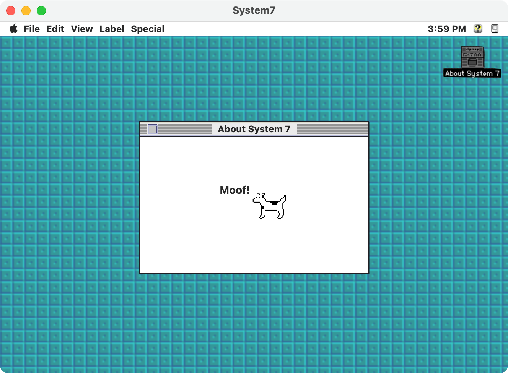
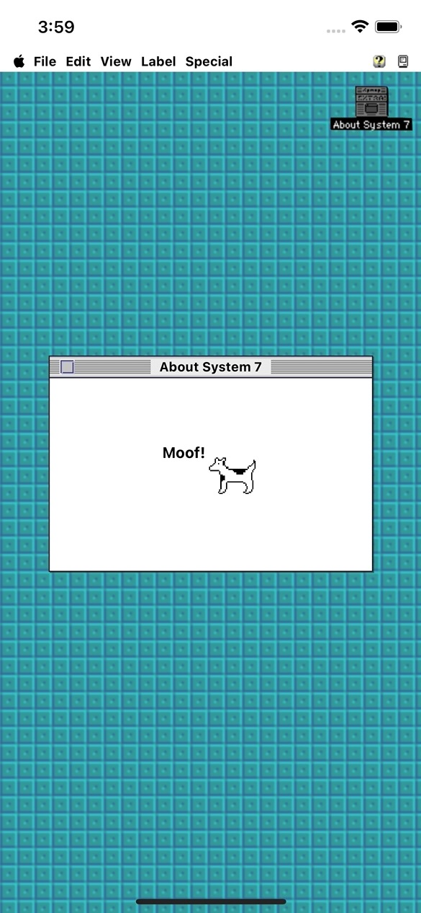

# WWDC21 Challenge - Throwback with SwiftUI 

I don't know about you, but Clarus holds a special place in my heart, so let's head back to 1991 to relive some System 7.0 nostalgia.

---

In this challenge I used SwiftUI to construct the System 7.0 style interface. Most of what you see is Swift UI with the exception of Clarus, the file icon, desktop pattern, and the menu bar icons on the right. I opted to stick with system fonts rather than trackin down the original system font - Chicago - or another modern variant (ChornoType would be a reasonable replacement). As with anything quick 'n dirty, it's far from perfect and only meant to serve as an exercise in SwiftUI layout to get the job done in a matter of a couple hours.

The Throwback with SwiftUI challenge can be found [here](https://developer.apple.com/news/?id=5qbbn6ut)

